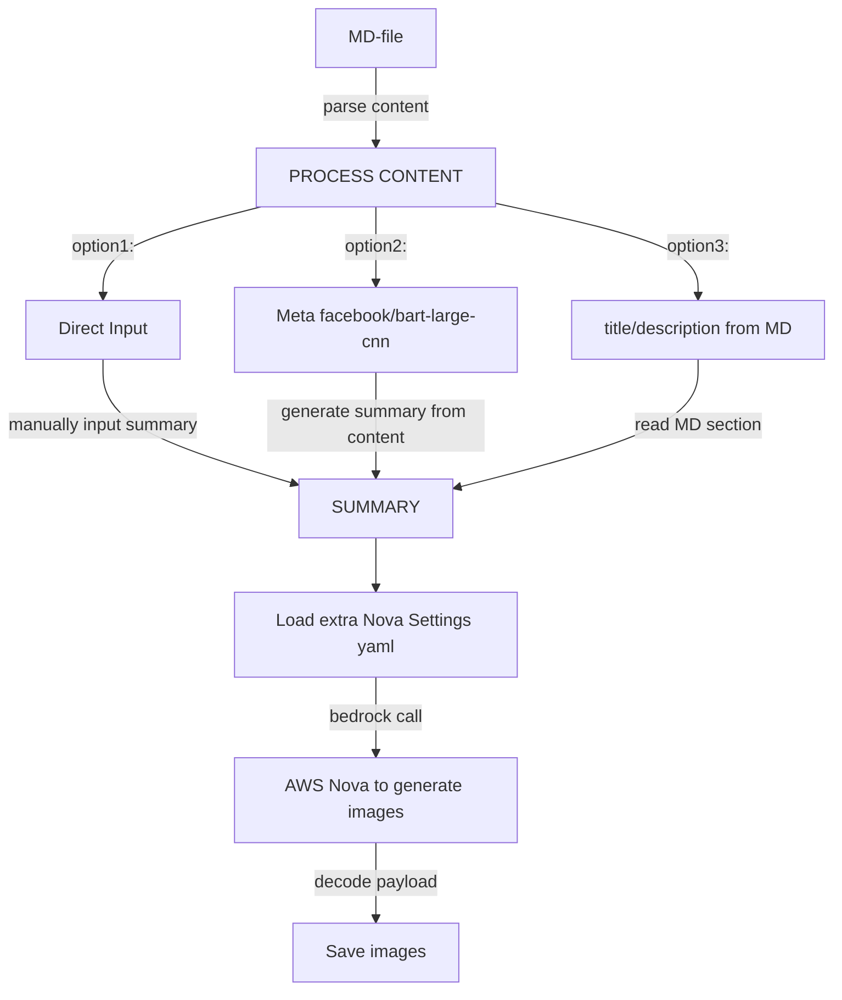

## Abstract

When hosting a post content majority of hosting platforms provide the **top header image** section that acts as a hook to associate blog's content with some visualization and this is actually the first big thing that audience will see.

<!--more-->

For content creators there are many libraries with free images like ``pexel``, also there non-free subscription based photos/images catalogues. Often you spend some time to select an image that is more accurate to blog post content.

But, such platforms perform images search only based on single tag input - so you can not fully search/describe the image that you are interested in.

## The idea

Having access to ``AWS Nova`` and looking at its latest features I got the idea that such images search (actually generation) based on post content can be automated using ``AWS Nova Canvas``.

The implementation is a cli tool, that:
- perform as a regular cli script (can be integrated into makefile, pipelines, flows and triggered manually)
- should have blog-post file in MD-format as input
- should be wizard-based (have step-by-step guided for user)
- should automatically summarize blog post text into few sentences (using some of Hugging Face summary models), but also have possibility to manually enter the summary
- read specific settings of fine tuning from yaml configuration file
- call AWS Nova Canvas to generate images according to summary and tuning settings

### Flow Diagram



### Configuration is extracted into YAML file

``AWS Nova Canvas`` has specific features that are a good candidate for extraction into commonly used configuration format ``yaml``. Having them isolated allows to tune parameters without cli tool modification.

By using them we can control the behaviour of image generator:

```yaml
colors:
  - "#FF9900"
  - "#3366FF"
numberOfImages: 5
width: 1280
height: 720
seed: 12
cfgScale: 6.5
summaryModel: "facebook/bart-large-cnn"
```

- **colors**: set the color gamma that will be used by AWS Nova when generating images
- **numberOfImages**: choose 3-5 so you can peel up from them
- **width x height** in pixels
- **seed**, **cfgScale** are Nova model controls:
- **summaryModel**: by default ``facebook large bart`` is used to prepare summary based on blog post content, can be switched to small or other model provider

### Text Summarization

This can be achieved using online cloud services, like ``AWS Comprehend``, ``Titan Models AWS Bedrock``, ``Sagemaker``, etc.

But I decided to apply offline local summarization using one of ``Hugging Face`` model ``facebook/bart-large-cnn"`` - it is Meta pretrained transformer model some variant of the **BART** (Bidirectional and Auto-Regressive Transformers) architecture, that fine-tuned for text summarization (particularly on the CNN/DailyMail dataset).

The goal is that later I can easily switch model to any other from ``Hugging Face``, that is more specific to knowledge domain, latest or more accurate.


## CLI tool execution is wizard-based

### Trigger flow

I have a new blog post, (actually this one) that is under ``2025-05-12-amazon-nova-canvas.md`` file **MD-format** and need to generate image for header.

To do this I'm invoking with python in cli:

```console
python3 ./scripts/nova_augment.py 2025-05-13-amazon-nova-canvas.md
```

Or through Makefile:

```console
make gen_image FILE=2025-05-13-amazon-nova-canvas.md
```

### Description is automatically extracted from post (if present)

If description is accurate and enough for images generation we can continue.
Otherwise, we can select - generate summary from content or input summary manually:

```console
--- Description extracted from front matter ---
Amazon Nova Canvas: creating images for blog posts

 What to use as a summary?
1. Direct input
2. Generate based on content
3. Use current Description

Your choice (1/2/3):
```

Next we can directly input summary or ask our model to generate summary based on post content.

### Summary is generated from post content

```console
--- Generated Summary by facebook/bart-large-cnn model---
I have a new blog post, actually this one that is under ``2025-05-12-canvas.md`` file and need to write. It's about creating images for blog posts with Amazon Nova Canvas.
First we check if post contains title or description, if so it outputs it. Next we can directly input summary or ask our model to generate summary based on post content. generate the header image.
```

### Specify color schema

Color schema defined in yaml file can instrument ``AWS Nova`` to generate images using main defined colors. At this step we are selecting to apply such config:

```console
Color Guided Generation:
1. Apply color guided generation ['#FF9900', '#3366FF']
2. Skip color guided generation

Do you want Color Guided Generation (1/2): 1

Generating 5 images (1280x720) ...
Image saved to output_image_0.png
Image saved to output_image_1.png
Image saved to output_image_2.png
Image saved to output_image_3.png
Image saved to output_image_4.png
```

Once processed - 5 images are generated, now I can review them and select the most appropriate for the post or perform re-prompt.

## Few examples of prompts VS images generation by AWS Nova

I was impressed by images quality and want to add here some examples that have initial prompt and generated images:

### Prompt 1:

> "Ship arrives to Robinson Crusoe island"
{: .prompt-tip }

{: .shadow }

{: .shadow }

{: .shadow }

{: .shadow }

{: .shadow }

### Prompt 2:

> "In the shadow of the House of Dragons, even kings kneel and the brave hold their breath."
{: .prompt-tip }

Nova is great for RPG games images generation - I'm adding in prompt a phrase from "Dungeons & Dragons" table game, we played in the childhood
a clone copy of this amazing game that was available in our country under the name "Enchanted Land".
So long ago our mind and generation were drawing all those characters and now it is so easy to build using AI.

{: .shadow }

{: .shadow }

{: .shadow }

{: .shadow }

{: .shadow }

### Prompt 3:

Prompt I used to generate header image to this post:

> "Car of the future for entire family. It can drive fly and swim and has maximum comfort and safety."
{: .prompt-tip }

{: .shadow }

{: .shadow }

{: .shadow }

{: .shadow }

{: .shadow }

## Lifehack: images resize in a second

At my blog I maintain same images in different copies with custom resolutions - for PC and mobile (to save users data traffic).

To resize image I'm using ``mogrify`` utility - just hit enter and image is done, no need to open any application, navigate menus, enter ``px`` - extremely fast & useful:

```console
mogrify -resize 300 -quality 100 generated/nova/output_image_4.png
```

## Code snippets of core blocks:

### Summarization with Meta

```python
def summarize_text(text: str, model) -> str:
  from transformers import pipeline
  summarizer = pipeline("summarization", model=model)
  # Handle long content by summarizing in chunks (Bart's max is ~1024 tokens)
  max_chunk = 1000
  chunks = [text[i:i + max_chunk] for i in range(0, len(text), max_chunk)]
  summary = ''
  for chunk in chunks:
    out = summarizer(chunk, max_length=150, min_length=40, do_sample=False)
    summary += out[0]['summary_text'] + '\n'
  return summary
```

### AWS Nova Canvas image generation

```python
def generate_image_with_nova(prompt: str, model_name: str, config, color: bool = None) -> None:
  bedrock = boto3.client('bedrock-runtime', region_name='us-east-1')  # adjust region

  nova_request = json.dumps(
    {
      "taskType": "TEXT_IMAGE",
      "textToImageParams": {
        "text": prompt
      },
      "imageGenerationConfig": {
        "cfgScale": config["cfgScale"],
        "seed": config["seed"],
        "width": config["width"],
        "height": config["height"],
        "numberOfImages": config["numberOfImages"],
        "quality": "standard"
      }
    }
  )

  if color:
    nova_request = json.dumps(
      {
        "colorGuidedGenerationParams": {
          "text": prompt,
          "colors":
            config["colors"]
        },
        "taskType": "COLOR_GUIDED_GENERATION",
        "imageGenerationConfig": {
          "cfgScale": config["cfgScale"],
          "seed": config["seed"],
          "width": config["width"],
          "height": config["height"],
          "numberOfImages": config["numberOfImages"],
        }
      }
    )

  response = bedrock.invoke_model(
    modelId=model_name,
    body=nova_request,
    contentType='application/json',
    accept='application/json'
  )
```

### Images extraction from payload

```python
result = json.loads(response['body'].read())
  from base64 import b64decode

  # Check if images are available in the response
  # make directory 'generated/current_date'
  folder_name = datetime.now().strftime("%Y-%m-%d")
  os.makedirs(f"generated/{folder_name}", exist_ok=True)

  if 'images' in result and result['images']:
    for idx, image_data in enumerate(result['images']):
      if image_data:
        with open(f"generated/{folder_name}/output_image_{idx}.png", "wb") as f:
          f.write(b64decode(image_data))
        print(f"Image saved to output_image_{idx}.png")
      else:
        print(f"No image data returned for image {idx}.")
  else:
    print("No images found in the response.")
```

## Conclusions

``AWS Nova Canvas`` is a great tool for generation of images that has prebuilt configurations and also allows to customize the uniqueness of data.

It is solid and easy with integration through **SDK** into any flow and provides excellent visualizations.

> Interesting observation - weeks later same prompts are generating the same images (maybe it is a cache/map per aws account or global model state, that after retrained and redeployment will show other results).
{: .prompt-info }

## Links:

- [Amazon Nova Canvas](https://docs.aws.amazon.com/bedrock/latest/userguide/bedrock-runtime_example_bedrock-runtime_InvokeModel_AmazonNovaImageGeneration_section.html)
- [sources of blog post image generation with aws nova](https://github.com/tsypuk/samples/tree/main/aws_nova)
